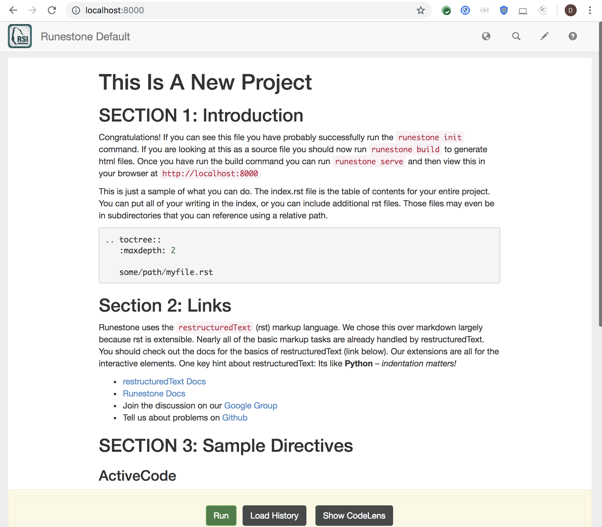

RunestoneComponents
===================

.. image:: https://img.shields.io/pypi/v/Runestone.svg
   :target: https://pypi.python.org/pypi/Runestone
   :alt: PyPI Version

.. image:: https://img.shields.io/pypi/dm/Runestone.svg
   :target: https://pypi.python.org/pypi/Runestone
   :alt: PyPI Monthly downloads

.. image:: https://travis-ci.com/RunestoneInteractive/RunestoneComponents.svg?branch=master
    :target: https://travis-ci.com/RunestoneInteractive/RunestoneComponents

Packaging of the Runestone components for publishing educational materials using Sphinx and restructuredText. Check out the `Overview <http://interactivepython.org/runestone/static/overview/overview.html>`_ To see all of the extensions in action.

Documentation
-------------

You will find the new `Authors Guide <https://runestone.academy/runestone/static/authorguide/index.html>`_

If you want to report any issues with the docs or submit PRs to improve them please do so on `github <https://github.com/RunestoneInteractive/runestoneinteractive.github.io/issues>`_

Quick Start
-----------

If you are completely new to pip and github text editors, I have written a more thorough getting started
 tutorial `on my blog <http://reputablejournal.com/how-to-make-a-lab-in-three-easy-steps.html>`_
 Otherwise, you can install everything you need with one simple command! (Although I recommend that you first create a virtual environment for your work.)

 **Install and make a Python virtualenv**

* Documentation here:  https://virtualenv.pypa.io/en/stable/
* Video here:  https://www.youtube.com/watch?v=IX-v6yvGYFg
* For the impatient:

::

    $ sudo pip install virtualenv
    $ virtualenv /path/to/home/MyEnv
    $ source /path/to/home/MyEnv/bin/activate

* You will need to do the last command **every time** you want to work on RunestoneComponents.  If you have not used Python virtual environments before I strongly recommend reading the docs or watching the video

* *Note:* You might need to install ``pip`` based on how you have installed `python <https://packaging.python.org/tutorials/installing-packages/#ensure-you-can-run-pip-from-the-command-line>`_.

With the virtual environment installed and configured you can continue.
::

    pip install runestone

Or, if you prefer to live on the development edge, you can check out the very latest from:

::

    pip install git+git://github.com/RunestoneInteractive/RunestoneComponents.git

To start a project, create a new folder and then run the following command (installed by pip)  in that new folder ``runestone init``  For example:

::

    mkdir myproject
    cd myproject
    runestone init

The init command will ask you some questions and setup a default project for you. The default response is in square brackets, example ``[false]``.

To build the included default project run

::

    runestone build

You will now have a build folder with a file index.html in it, along with some default content.  The contents of the build folder are suitable for hosting anywhere that you can serve static web content from!  For a small class you could even serve the content using the builtin Python webserver.

*Note:* If you come across version conflict with ``six`` library while building the project, ``pip install --ignore-installed six`` command might be useful.

::

    $ runestone serve

Now from your browser you can open up ``http://localhost:8000/index.html``  You should see the table of contents for a sample page like this:

If you edit ``_sources/index.html`` or ``_sources/overview.rst`` and then rebuild and serve again you will see your changes.  The best documentation is probably the overview.rst file itself, as it demonstrates how to use all of the common components and shows most of their options.

**Windows Users** I have tested the installation, along with init, build, and serve on Windows 8.1.
The biggest pain is probably setting your PATH environment variable so you can simply type the commands
from the shell.  Please note that I am not a regular user of windows, I only test things on my VMWare
installation every so often.  If you are new to using Python on windows I recommend you check out this
link on `Using Python with Windows <https://docs.python.org/3.4/using/windows.html>`_

Developing and Hacking
----------------------

So, you would like to help out with developing the Runestone Components.  What do you need to know?  Check out the `Development Roadmap <https://github.com/bnmnetp/runestone/wiki>`_ to get an understanding of our migration towards webcomponents.

1.  Make a Fork of this repository.
2.  Set up your environment on your development machine

    1.  Make a virtual environment for testing and working  (I recommend pyvenv-3.4  as it is baked in to Python 3.4 and higher)
    2.  To use Runestone Components, rather than following the instructions above for installing runestone simply run ``pip install -e .`` from the top level runestone directory.  This will install all of the required prerequisites and setup the runestone install as a link to the development directory. Once you've done that, you can continue following the instructions in the Quick Start section from the line starting with ``mkdir myproject``.

3.  When you have some changes to share, make a Pull Request.

(See the RunestoneServer repository and **http://runestoneinteractive.org** for more complete documentation on how this project works.)

Writing Tests
-------------

A great way to contribute to the Runestone Components repository is to add to our test suite.

Our goal is to have unit tests which rely on Selenium (a library that helps simulate interactions in a web browser) for each directive, to see if the JavaScript that powers the directives is working correctly.

**In order to get started with writing a test/writing additional tests, you will need the following:**

* Download the latest `ChromeDriver <https://chromedriver.storage.googleapis.com/index.html>`_., which is a driver that simulates Google Chrome.

* On linux you will need to install Xvfb ``apt-get install xvfb``

* You'll also need to have done the above installation.

  * You should be using virtual environment,
    you'll need a clone of the RunestoneComponents repository,
    and you'll need to have done ``pip install -e .`` from
    the top level of the RunestoneComponents directory.

* If you have installed RunestoneComponents in your virtualenv using ``pip install -e .``,
  then you should have all the python dependencies you need.

  * ``pip install selenium`` in the virtualenv you're using for Runestone Components development
  * ``pip install pyvirtualdisplay``

**To run tests:**

* Make sure the directory containing the PhantomJS executable is in your ``PATH`` environment variable. e.g. ``PATH=$PATH:path/to/virtualenv/directory/where/it/is/here`` at your command line (or edit your ``.bash_profile``). It should live in the site-packages/selenium/webdriver/ directory of your virtualenv.

* Check out the existing tests, e.g. the ``test_question.py`` file that tests the Question directive, which you can find at the path ``/runestone/question/test/test_question.py``, for an example.

* Each directive's individual set of tests requires a mini book. You'll see a ``_sources`` folder for each existing test containing an ``index.rst`` file. That file contains a title, as required by ``.rst``, and whatever directive examples you want to test.

* Finally, to run a test, ensuring that you have accessed a directive folder, type the following at the command prompt:

  * ``python -m unittest discover``

.. note::

  8081 is the default test port.
  If you are running another server on this port, you may encounter an error.
  See the Python files, e.g. ``test_question.py``, to see how this is set up.

You should then see some test output, showing a pass (``ok``), FAIL, or error(s).

If you have an error relating to PhantomJS/a driver in the output, you probably have a PATH or driver installation problem.

**To write a new test:**

* Create a ``test`` directory inside a directive's folder

* Create a Python file to hold the test suite inside that directory, e.g. ``test_directivename.py``

* Run ``runestone init`` inside that folder and answer the following prompts

* Write the appropriate directive example(s) inside the ``index.rst`` file (which will be created as a result of ``runestone init``)

* Edit the Python file you created as appropriate (see documentation for the Python ``unittest`` module `In the Python docs <https://docs.python.org/2/library/unittest.html>`_.)

Notes for more Advanced Users
-----------------------------

If you already have an existing `Sphinx <http://sphinx-doc.org>`_  project and you want to incorporate the runestone components into your project you can just make a couple of simple edits to your existing ``conf.py`` file.

* First add the following import line ``from runestone import runestone_static_dirs, runestone_extensions``
* Then modify your extensions.  You may have a different set of extensions already enabled, but it doesn't matter just do this:  ``extensions = ['sphinx.ext.mathjax'] + runestone_extensions()``
* Then modify your html_static_path:  ``html_static_path = ['_static']  + runestone_static_dirs()``  Again you may have your own set of static paths in the initial list.

See https://github.com/bnmnetp/runestone/wiki/DevelopmentRoadmap to get a sense for how this is all going to come together.

Researchers
-----------

If you use Runestone in your Research or write about it, please reference ``https://runestone.academy`` and cite this paper:

::

   @inproceedings{Miller:2012:BPE:2325296.2325335,
    author = {Miller, Bradley N. and Ranum, David L.},
    title = {Beyond PDF and ePub: Toward an Interactive Textbook},
    booktitle = {Proceedings of the 17th ACM Annual Conference on Innovation and Technology in Computer Science Education},
    series = {ITiCSE '12},
    year = {2012},
    isbn = {978-1-4503-1246-2},
    location = {Haifa, Israel},
    pages = {150--155},
    numpages = {6},
    url = {http://doi.acm.org/10.1145/2325296.2325335},
    doi = {10.1145/2325296.2325335},
    acmid = {2325335},
    publisher = {ACM},
    address = {New York, NY, USA},
    keywords = {cs1, ebook, sphinx},
   }
